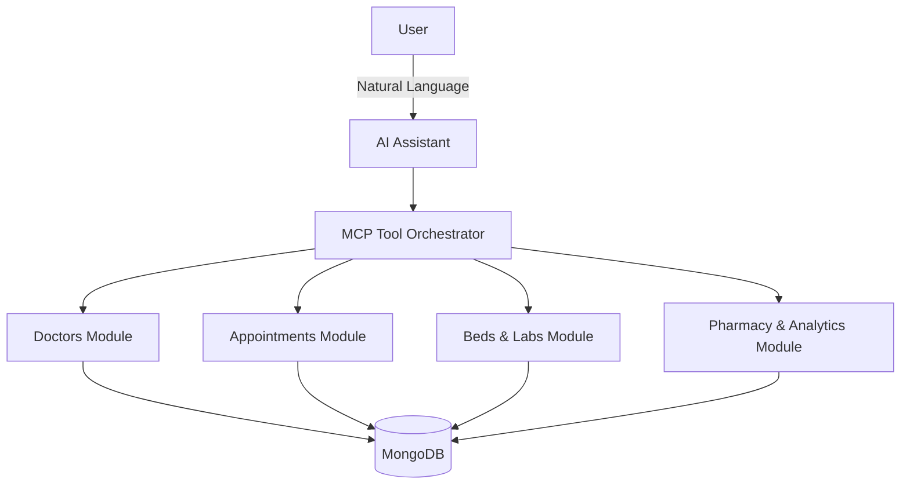

# 🏥 ArogyaAI OS – AI-Powered Hospital Intelligence Platform

> **One Intelligent Platform for Smarter Healthcare.**

ArogyaAI OS is an AI-powered healthcare platform that helps patients access healthcare quickly while helping hospitals manage appointments, beds, laboratories, pharmacies, emergencies, and analytics through one intelligent assistant.

---

## ⚠️ The Problem
Healthcare systems today are heavily fragmented. Hospitals typically use completely separate software for Appointment Booking, Doctor Management, Laboratories, Pharmacies, Bed Management, Emergency Response, and Administration.

**This leads to:**
- Long waiting times
- Manual coordination errors
- Resource wastage
- Poor patient experience
- Complete lack of real-time operational insights

## 💡 Our Solution
**ArogyaAI OS unifies these disconnected systems into a single AI-powered platform.** 

Instead of opening multiple applications, users simply describe what they need in natural language. For example, if a user says *"I have chest pain"*, the platform automatically:
1. Assesses the request
2. Finds the appropriate doctor (Cardiologist)
3. Checks ICU bed availability
4. Books the emergency appointment
5. Provides clear, immediate recommendations to the patient

---

## 🎯 Target Audience & Impact

| Audience | Benefits & Features |
| :--- | :--- |
| **Patients** | Search doctors, book appointments, get health guidance, receive reminders, and trigger emergency assistance. |
| **Doctors** | Manage schedules, view appointments, and receive AI-generated patient summaries before consultations. |
| **Hospital Staff** | Manage beds, pharmacy inventory, laboratory reports, and emergency coordination. |
| **Administrators** | Access hospital analytics, executive dashboards, resource utilization, and operational monitoring. |

---

## ⚙️ Architecture & Technologies

**Frontend:** Next.js, React, TypeScript  
**Backend:** Node.js, TypeScript, NitroStack SDK, Model Context Protocol (MCP)  
**Database:** MongoDB  
**Validation:** Zod  

### System Architecture Flow

---

## 🧠 Core AI Modules

1. **AI Health Copilot**: Acts as an intelligent triage assistant. It understands symptoms, suggests departments, and recommends doctors.
2. **Multi-Agent Orchestrator**: Instead of handling every request linearly, it delegates complex tasks (e.g., *"Find an ICU bed and a cardiologist"*) to specialized sub-agents.
3. **AI Incident Commander**: Designed for high-stakes emergencies. It generates incident timelines, notifies departments, prioritizes cases, and reserves hospital resources instantly.
4. **AI What-If Simulator**: Allows administrators to predict queue growth and capacity bottlenecks during hypothetical scenarios (e.g., *"What if 50 emergency patients arrive?"*).
5. **Executive Analytics**: Generates real-time, natural-language daily briefings regarding hospital operations and resource utilization.

---

## 🛡️ Explainable AI & System Resilience

- **Explainability**: Every single AI decision exposes its `Decision Path`, `Prediction Reason`, and `Confidence Score`. We believe in transparency and user trust.
- **Resilience Layer**: If an internal hospital service becomes unavailable (e.g., the pharmacy DB goes offline), the orchestrator detects the failure, uses cached fallback mechanisms, and continues operating without crashing.

---

## 🛠️ MCP Tools Exposed

The project exposes deterministic capabilities via the **Model Context Protocol (MCP)**:
- `search-doctors`, `compare-slots`, `doctor-summary`
- `book-appointment`, `get-appointment`, `cancel-appointment`
- `health-assistant`, `report-emergency`, `incident-commander`
- `bed-status`, `medicine-search`, `search-test`, `lab-report-status`
- `hospital-command-agent`, `what-if-simulator`, `executive-briefing`

---

## 💼 Business Model & Competitive Advantage
**Revenue Streams**: SaaS Subscriptions, Enterprise Licensing, Premium Analytics Integrations.

**Competitive Advantage**: Unlike standard booking apps, ArogyaAI combines patient assistance, hospital operations, multi-agent AI coordination, operational analytics, and explainable AI into **one integrated, conversational platform.**

---

## 🚀 Future Scope
- Telemedicine & EHR Integration
- Wearable device sync & Predictive healthcare analytics
- Voice-based assistant support
- FHIR Interoperability standards
- Real-time ambulance tracking

---

## 🎤 Elevator Pitch (60 Seconds)
*ArogyaAI OS is an AI-powered Hospital Intelligence Platform built for modern healthcare. Instead of relying on separate systems for appointments, doctor discovery, bed management, laboratories, pharmacies, emergencies, and hospital analytics, ArogyaAI brings everything together through one intelligent conversational interface. Patients receive faster access to care, while hospitals gain better operational visibility and efficiency. Built with NitroStack, MCP, Node.js, Next.js, and MongoDB, the platform is modular, scalable, and designed to evolve with future healthcare needs.*
