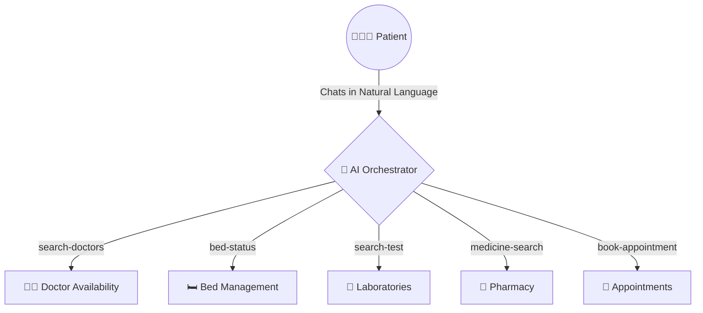
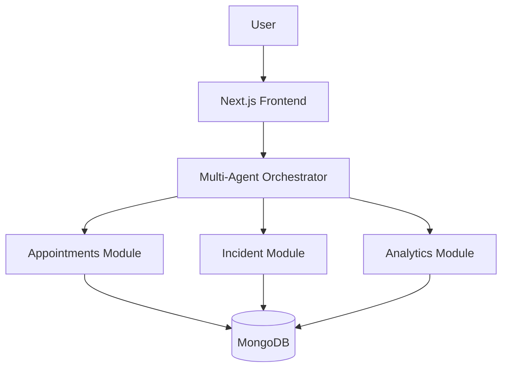

  

  # 🏥 ArogyaAI OS
  
  > **Making Hospitals Easier for Everyone.**

  *ArogyaAI is an AI-powered Hospital Intelligence Platform that transforms the chaotic healthcare experience into a seamless, conversational journey.*

  
  
  
  

  

---

## 📖 The Real Story: Why We Built This

Imagine this situation. 

It is 10 PM. Your father suddenly develops severe chest pain. You immediately rush him to the nearest hospital. Every second counts. 

But instead of receiving immediate, coordinated treatment, you face a wall of administrative chaos:
- *Which doctor is actually available right now?*
- *Is there an ICU bed open?*
- *Which registration counter do I go to?*
- *Where is the emergency department?*
- *Is the required emergency medicine in stock?*

Instead of focusing on the patient, everyone—the family, the receptionists, the nurses—is scrambling to find fragmented information across different systems. 

This terrifying, confusing experience happens every single day in hospitals across the world. Hospitals become the most confusing exactly when people need help the most.

---

## 🚨 Why This Problem Matters 

The healthcare system is buckling under administrative and operational overload. This isn't just a minor inconvenience; it is a global crisis affecting patient outcomes.

> [!CAUTION]
> **Verified Healthcare Realities**
> - **Outpatient Delays**: Patients in developing nations often spend **70% of their hospital visit time** just waiting in queues for registration and consultation. ([Source: NITI Aayog Health Reports](https://www.niti.gov.in/))
> - **Emergency Overcrowding**: Emergency department overcrowding is linked to increased mortality rates and delays in critical treatments. ([Source: WHO Emergency Care](https://www.who.int/health-topics/emergency-care))
> - **Digital Transformation Proof**: Implementing instant digital interventions (like India's ABDM Scan & Share) reduced OPD registration waiting times from **~1 hour down to just 2–5 minutes** across thousands of hospitals. ([Source: National Health Authority India](https://abdm.gov.in/))
> - **Coordination Lags**: ICU transfers and bed coordination can take hours due to siloed hospital management systems that do not talk to each other. ([Source: PubMed Central](https://www.ncbi.nlm.nih.gov/pmc/))

---

## 😔 Everyday Problems & Our Solutions

<b>Problem 1: "I don't know which doctor to consult."</b>

 

❌ **Existing Experience**: Patients guess their specialty requirement or wait in triage lines just to be directed to the right department.  
✅ **ArogyaAI Solution**: You tell the AI your symptoms. The **Smart Doctor Discovery** engine analyzes the symptoms, identifies the exact specialist you need, and checks their availability in real-time.

  
   
  

<b>Problem 2: Long Waiting Times</b>

 

❌ **Existing Experience**: Booking an appointment requires navigating clunky web portals or making phone calls, only to arrive and wait for hours.  
✅ **ArogyaAI Solution**: The **Appointment Booking** & **Compare Slots** tools find the earliest available overlap, booking your slot instantly and natively predicting queue delays.

  
   
  

<b>Problem 3: Emergency Confusion</b>

 

❌ **Existing Experience**: Rushing into an ER with zero prior coordination, waiting for triage.  
✅ **ArogyaAI Solution**: The **Incident Commander** detects severe inputs (e.g. "chest pain"), prioritizes the workflow, and instantly pages the right departments before you even arrive.

  
   
  

<b>Problem 4: Finding ICU Beds</b>

 

❌ **Existing Experience**: Nurses manually calling wards to check bed censuses.  
✅ **ArogyaAI Solution**: The **Bed Availability** tracker gives the AI real-time access to general, ICU, and emergency bed counts.

  

<b>Problem 5: Searching Medicines & Labs</b>

 

❌ **Existing Experience**: Walking to the pharmacy only to find the medicine is out of stock.  
✅ **ArogyaAI Solution**: The **Medicine Search** and **Lab Search** tools allow you to check stock and diagnostic test availability directly through the chat.

  
  

<b>Problem 6: Hospital Staff Overload</b>

 

❌ **Existing Experience**: Administrators piecing together reports from 5 different software systems.  
✅ **ArogyaAI Solution**: The **Analytics Dashboard** and **What-if Simulator** aggregate hospital data into a single pane of glass, allowing executives to simulate surges and manage capacity.

  
   
  

---

## 💡 The Unified Solution Overview

ArogyaAI acts like a smart hospital assistant. Instead of clicking through menus or switching between apps, everything is solved through one intelligent conversation.

---

## ✨ Core Features

| Feature | Description | Visual |
| :--- | :--- | :--- |
| 🤖 **AI Health Assistant** | Empathetic triage and symptom analysis. |  |
| 🚨 **Incident Commander** | AI coordination of high-stakes medical emergencies. |  |
| 📊 **Executive Briefing** | Natural language daily summaries for hospital admins. |  |
| 🏥 **Hospital Command Agent** | Multi-agent delegator managing complex intents. |  |

---

## ⚖️ Before vs. After

| The Old Way (Without ArogyaAI) | The New Way (With ArogyaAI) |
| :--- | :--- |
| Stand in a queue to find which doctor to see. | **AI maps symptoms to the exact specialist instantly.** |
| Visit 3 different counters for bed, lab, and pharmacy info. | **Ask one question, get answers from all departments.** |
| Administrators react to overcrowding as it happens. | **What-If Simulators predict bottlenecks before they occur.** |
| Emergency response relies on manual phone calls. | **AI pages doctors and reserves beds autonomously.** |

---

## 📸 Full System Gallery

Click to view all platform screenshots

- 
- 
- 
- 
- 
- 
- 
- 
- 
- 
- 
- 
- 
- 

---

## 🏗️ Architecture

Under the hood, ArogyaAI is a highly modular, decoupled enterprise system leveraging the Model Context Protocol (MCP) to safely expose hospital infrastructure to AI agents.

---

## 🔌 MCP Tools (Model Context Protocol)

We expose the hospital's capabilities deterministically via MCP tools:

| MCP Tool | Purpose |
| :--- | :--- |
| `search-doctors` | Ranks and retrieves specialists. |
| `compare-slots` | Finds overlapping schedules. |
| `book-appointment` | Atomic reservation with queue prediction. |
| `health-assistant` | Initial triage and symptom analysis. |
| `incident-commander` | Coordinates emergency workflows. |
| `what-if-simulator` | Models hypothetical hospital surges. |
| `executive-briefing` | Generates NLP hospital summaries. |
*(Also includes: `doctor-summary`, `get-appointment`, `cancel-appointment`, `report-emergency`, `bed-status`, `medicine-search`, `search-test`, `lab-report-status`, `hospital-command-agent`)*

---

## 💻 Technology Stack

  
  
  
  
  
  
  

---

## 🌍 Future Vision

We envision ArogyaAI becoming a universal digital healthcare layer that seamlessly connects patients, doctors, hospitals, laboratories, pharmacies, and emergency services into one stress-free experience, globally.

---

> ### *"Patients should spend their time recovering—not searching."*
